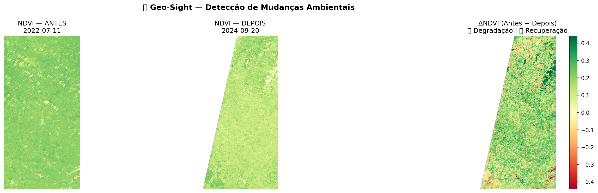

# 🛰️ Geo-Sight — Monitoramento Ambiental por Satélite

Ferramenta de detecção automática de mudanças ambientais utilizando imagens reais do satélite **Sentinel-2** via Microsoft Planetary Computer.

---

## 📌 Sobre o Projeto

O Geo-Sight é um MVP desenvolvido de forma autodidata como projeto de aprendizado em geoprocessamento e sensoriamento remoto. A ferramenta busca imagens reais de satélite, calcula o índice de vegetação NDVI e compara dois períodos temporais distintos, identificando automaticamente áreas com degradação ou recuperação ambiental.

> **Resultado real detectado no Maranhão (2022 → 2024):**  
> ⚠️ 24,8% de área com degradação ambiental identificada com dados reais de satélite.

---

## 🖼️ Resultado



---

## ⚙️ Como Funciona

1. **Busca de imagens** — Conecta ao Microsoft Planetary Computer e busca automaticamente imagens Sentinel-2 com menos de 30% de cobertura de nuvem para as coordenadas e datas informadas
2. **Processamento de bandas** — Carrega as bandas B04 (Red) e B08 (NIR) a 60m de resolução
3. **Cálculo do NDVI** — Aplica a fórmula `NDVI = (NIR - Red) / (NIR + Red)` para os dois períodos
4. **Mapa de variação** — Gera o `ΔNDVI = NDVI_antes − NDVI_depois`, onde valores positivos indicam degradação e negativos indicam recuperação
5. **Métricas quantitativas** — Calcula a porcentagem de pixels com variação significativa (limiar de 0.25)

---

## 🚀 Como Usar

### Pré-requisitos

```bash
pip install jupyter pystac-client planetary-computer odc-stac odc-geo numpy matplotlib rioxarray
```

### Executando

```bash
jupyter notebook
```

Abra o arquivo `Untitled.ipynb` e execute as células na ordem:

| Célula | Descrição |
|--------|-----------|
| 1 | Imports das bibliotecas |
| 2 | Configuração de coordenadas e datas |
| 3 | Busca das imagens no Planetary Computer |
| 4 | Cálculo do NDVI para os dois períodos |
| 5 | Geração do mapa e métricas |

### Personalizando a área de análise

Na **Célula 2**, edite as variáveis:

```python
LAT = -3.7327          # Latitude do centro da área
LON = -45.3648         # Longitude do centro da área
DATA1_INICIO = "2022-07-01"   # Início do período ANTES
DATA1_FIM    = "2022-09-30"   # Fim do período ANTES
DATA2_INICIO = "2024-07-01"   # Início do período DEPOIS
DATA2_FIM    = "2024-09-30"   # Fim do período DEPOIS
```

---

## 📊 Saídas Geradas

- `geo_sight_resultado.png` — Mapa com NDVI antes, depois e variação lado a lado
- `geo_sight_quadrado.png` — Versão compacta do mapa
- Métricas no terminal: % de área degradada, % recuperada e ΔNDVI médio

---

## 🛠️ Stack

| Tecnologia | Uso |
|------------|-----|
| Python 3.11 | Linguagem principal |
| Jupyter Notebook | Ambiente de execução |
| pystac-client | Busca no catálogo STAC |
| planetary-computer | Acesso ao Microsoft Planetary Computer |
| odc-stac | Carregamento das bandas espectrais |
| NumPy | Cálculo do NDVI |
| Matplotlib | Visualização dos mapas |
| rioxarray | Manipulação de dados raster |

---

## 🌍 Fonte de Dados

- **Satélite:** Sentinel-2 L2A (ESA — Agência Espacial Europeia)
- **Plataforma:** [Microsoft Planetary Computer](https://planetarycomputer.microsoft.com/)
- **Acesso:** Público e gratuito, sem necessidade de cadastro ou token

---

## 👩‍💻 Autora

**Camila Luiza Silva Machado**  
Acadêmica de Engenharia de Computação — UEMA  
São Luís, MA

[](https://linkedin.com)
[](https://github.com/camilaluizamachado)
